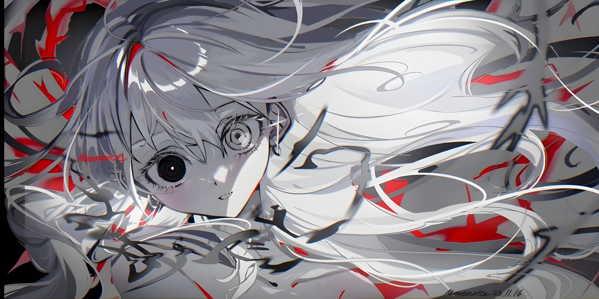

<h1 align="center">you will not run away from the gaze of truth</h1>

  

---

## ❖ who am i

- 🧩 saykachi / saya'
- 🧠 thinker. coder. dreamer.
- 🕯 i build web apps and backend systems
- 💙 romcoms, cold nights, and code under the stars
- 🌀 lost in thought, often about things that don’t have answers

---

## ❖ tools & languages

---

## ❖ current state

> trying to surprise the world, in silence.

---

  

  <i>“a calm chaos — that’s what it feels like to create.”</i>

